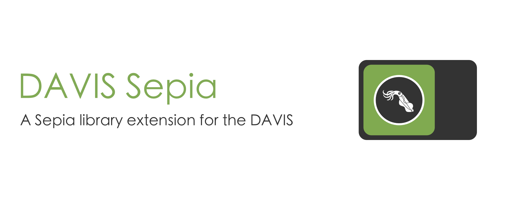

DAVIS Sepia is an extension to the [Sepia](https://github.com/neuromorphic-paris/sepia) library to read events from a DAVIS.

# install

## clone

Within a Git repository, run the commands:

```sh
mkdir -p third_party
cd third_party
git submodule add https://github.com/neuromorphic-paris/davis_sepia.git
git submodule update --init --recursive
```

## dependencies

An application using DAVIS Sepia must link to usb-1.0.

### Debian / Ubuntu

Open a terminal and run:
```sh
sudo apt install libusb-1.0 # cross-platform USB API
```

### macOS

Open a terminal and run:
```sh
brew install libusb # cross-platform USB API
```
If the command is not found, you need to install Homebrew first with the command:
```sh
ruby -e "$(curl -fsSL https://raw.githubusercontent.com/Homebrew/install/master/install)"
```

# contribute

## development dependencies

### Debian / Ubuntu

Open a terminal and run:
```sh
sudo apt install premake4 # cross-platform build configuration
sudo apt install clang-format # formatting tool
```

### macOS

Open a terminal and run:
```sh
brew install premake # cross-platform build configuration
brew install clang-format # formatting tool
```

## test

To test the library, run from the *davis_sepia* directory:
```sh
premake4 gmake
cd build
make
cd release
./davis_sepia
```

After changing the code, format the source files by running from the *davis_sepia* directory:
```sh
clang-format -i source/davis_sepia.hpp
clang-format -i test/davis_sepia.cpp
```

# license

See the [LICENSE](LICENSE.txt) file for license rights and limitations (GNU GPLv3).
